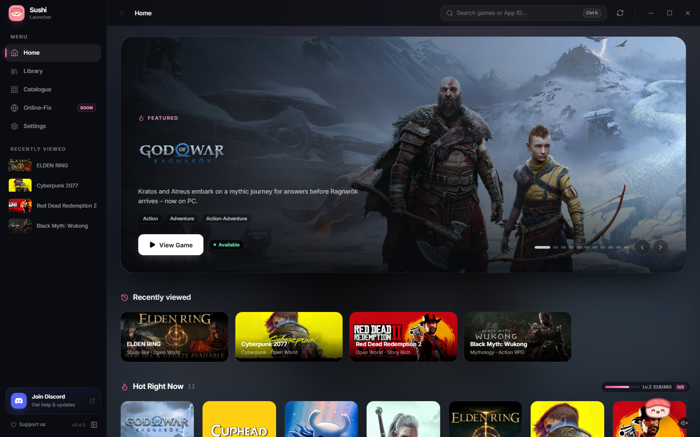
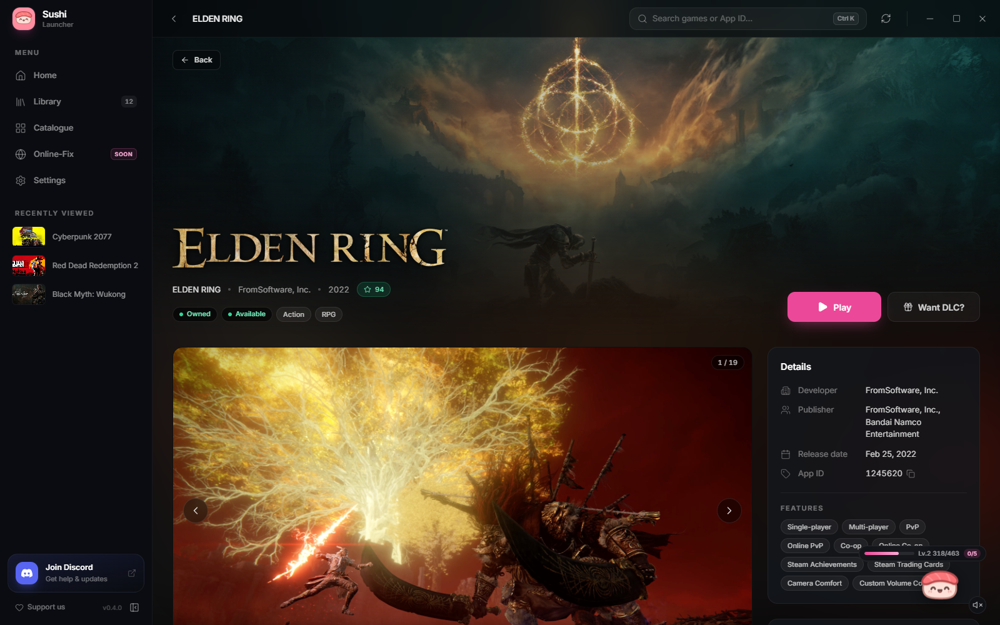
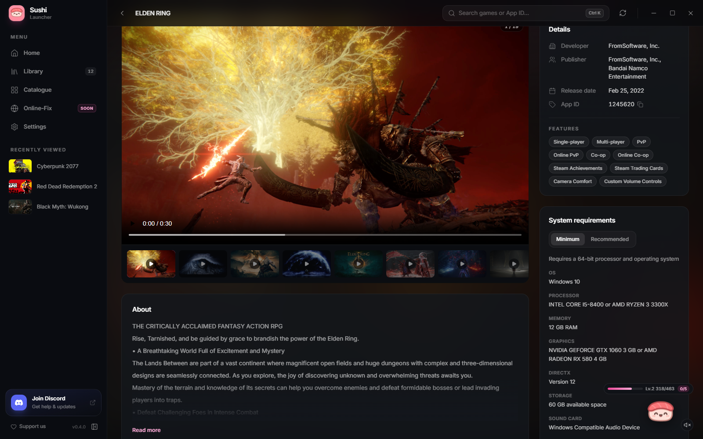
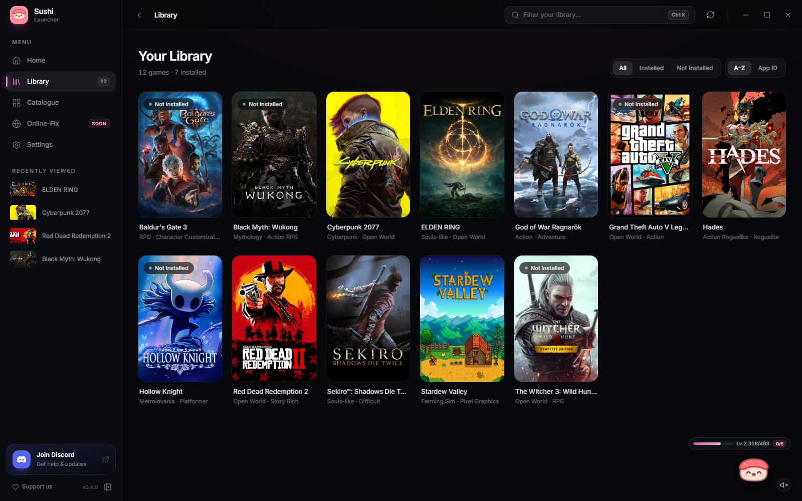
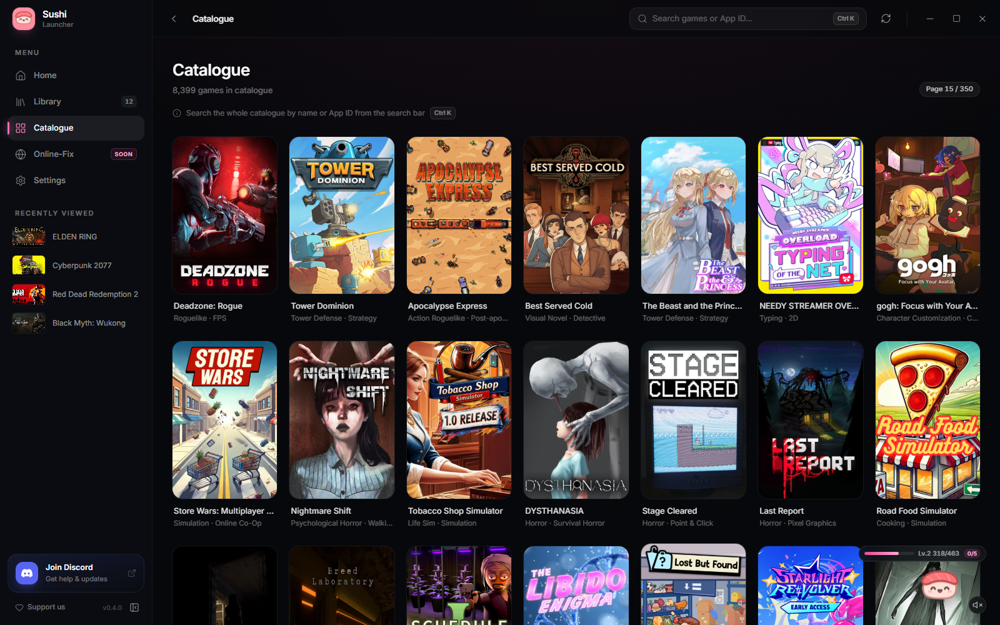
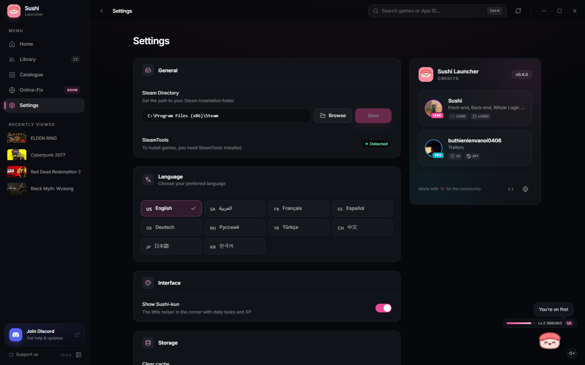

# 🍣 Sushi Launcher
### The Ultimate Game Launcher with a Beautiful UI
[](https://github.com/sushi-dev55/Sushi-Launcher/releases/tag/V0.4.0)
[](https://discord.gg/PYgAMs9PU9)
[](https://sushi-launcher.vercel.app/)
[](https://www.youtube.com/watch?v=pjBrwJRbIXs)

**Sushi Launcher** is a sleek, modern game launcher built with Tauri and React. Tall game covers, a featured banner with the real game logos, trailers that actually play, and a dark theme with pink accents, all in a launcher that opens fast and stays fast.

[📥 Download](#-download) • [🆕 What's New](#-whats-new-in-v040) • [✨ Features](#-features) • [📸 Screenshots](#-screenshots) • [🎬 Tutorial](#-tutorial) • [💬 Discord](#-community)

---

## 📸 Screenshots


*🏠 Home - Featured games with their logos, recently viewed and hot right now*


*🎮 Game Page - Big banner, details and one-click install*


*🎬 Media - Trailers, screenshots, features and system requirements*


*📚 Library - Your games with filters and hover to play*


*🗂️ Catalogue - Browse and search thousands of games*


*⚙️ Settings - Steam directory, SteamTools status, languages and more*

---

## 🆕 What's New in v0.4.0

- 🎨 **Brand new UI** - tall game covers, a featured banner with the actual game logos and one clean top bar instead of 3 stacked ones
- 🎮 **Redone game pages** - big banner, trailers, screenshots, details and system requirements
- ⚡ **Way faster** - opens without waiting on the update check, game info is saved, and catalogue pages load in 1 request instead of 24
- 🛠️ **Fixed "Couldn't load game"** - Steam was blocking the launcher for sending too many requests, so it now uses a Steam API that doesn't get blocked
- 🎬 **Trailers play again** - Steam changed their video format and the old player couldn't handle it
- 📦 **Full catalogue** - it was only showing the first 1,000 games on repeat, now it shows every game (newest first)
- 🔍 **Search from anywhere** - press `Ctrl+K` on any page
- 🔓 **NSFW games aren't blocked anymore**

---

## ✨ Features
| Feature | Description |
|---------|-------------|
| 🎨 **Premium UI** | Dark theme with pink accents, tall game covers, smooth animations and a glass top bar |
| 🏠 **Home Page** | Featured games carousel with game logos, recently viewed and "Hot Right Now" |
| 📚 **Library** | All your games with All / Installed / Not installed filters and hover to play |
| 🗂️ **Catalogue** | Browse and search every game in the repo, newest first, and the next page loads before you click it |
| 🔍 **Search Anywhere** | Search the whole catalogue by name or App ID from any page (`Ctrl+K`) |
| 🎮 **Game Pages** | Trailers, screenshots, developer and release info, features and system requirements |
| 🕘 **Recently Viewed** | Jump back to games you opened from the sidebar or home |
| ⚡ **Fast** | Game info is cached between launches and pages load with batched requests |
| 🌐 **Online-Fix** | Coming soon! |
| 🌍 **Multi-Language** | 10 languages: English, Arabic, French, Spanish, German, Russian, Turkish, Chinese, Japanese, Korean |
| 🔄 **Update Notifications** | Get notified in the launcher when a new version is out |
| ⚙️ **Custom Titlebar** | Frameless window with integrated controls |
| 💾 **One-Click Install** | Easy game installation |
| 🔁 **Steam Restart** | Prompt to restart Steam after installing |
| 🍣 **Sushi-kun** | Mascot with daily tasks and XP (can be hidden in Settings) |

---

## 📥 Download
### Latest Release: v0.4.0
👉 **[Download Sushi Launcher v0.4.0 (.exe)](https://github.com/sushi-dev55/Sushi-Launcher/releases/download/V0.4.0/Sushi.Launcher_0.4.0_x64-setup.exe)**

or grab it from the **[Releases page](https://github.com/sushi-dev55/Sushi-Launcher/releases)**

> ⚠️ **Note:** Download the `.exe` file, not the source code!

---

## 🎬 Tutorial
New to Sushi Launcher? Watch the setup tutorial:

[](https://www.youtube.com/watch?v=pjBrwJRbIXs)

---

## 📋 Version History
| Version | Release Date | Highlights |
|---------|--------------|------------|
| **v0.4.0** | Sep 13, 2026 | Brand new UI, way faster loading, fixed "Couldn't load game", trailers play again, full catalogue, search from anywhere, NSFW games no longer blocked |
| **v0.2.3** | Feb 2026 | Migrated to Tauri v2, UI Improvements, Animation Fixes |
| **v0.2.1** | Jan 22, 2026 | Redesigned Catalogue UI, Library rework (.lua support), In-launcher downloads, DLC Adder, Credits & Donations |
| **v0.2.0** | Dec 2025 | Multi-language support, Online-Fix tab, Auto-update, Steam restart prompt, Custom titlebar |
| **v0.1.0** | Dec 2025 | Initial release - Home, Library, Catalogue, Game details, Installation |

---

## 🛠️ Tech Stack
- 🦀 **Tauri 2** - Desktop app with a Rust backend
- ⚛️ **React 19** - UI framework
- 🎨 **Tailwind CSS** - Styling
- ⚡ **Vite 7** - Build tool
- 🎮 **Steam Store API** - Game data, artwork and trailers
- 🎞️ **hls.js** - Trailer playback

---

## 💬 Community
Have questions? Need help? Want updates? Join our Discord server!

[](https://discord.gg/PYgAMs9PU9)

---

## 🌐 Website
Visit the official Sushi Launcher website:

👉 **[sushi-launcher.vercel.app](https://sushi-launcher.vercel.app/)**

---

## 📜 Usage & Credits
You are free to use this launcher on your own server, **BUT**:
> ⚠️ **You MUST give credits and include the Discord server invite!**
```
Credits: Sushi Launcher by sushi-dev55
Discord: https://discord.gg/PYgAMs9PU9
```

---

## ⭐ Support
If you like Sushi Launcher, please:
- ⭐ **Star this repository**
- 🐛 **Report bugs** on Discord
- 💡 **Suggest features** on Discord
- 📢 **Share with friends**

---

### Made with 💖 by sushi-dev55
**[Website](https://sushi-launcher.vercel.app/)** • **[Discord](https://discord.gg/PYgAMs9PU9)** • **[YouTube](https://www.youtube.com/watch?v=pjBrwJRbIXs)** • **[Releases](https://github.com/sushi-dev55/Sushi-Launcher/releases)**
